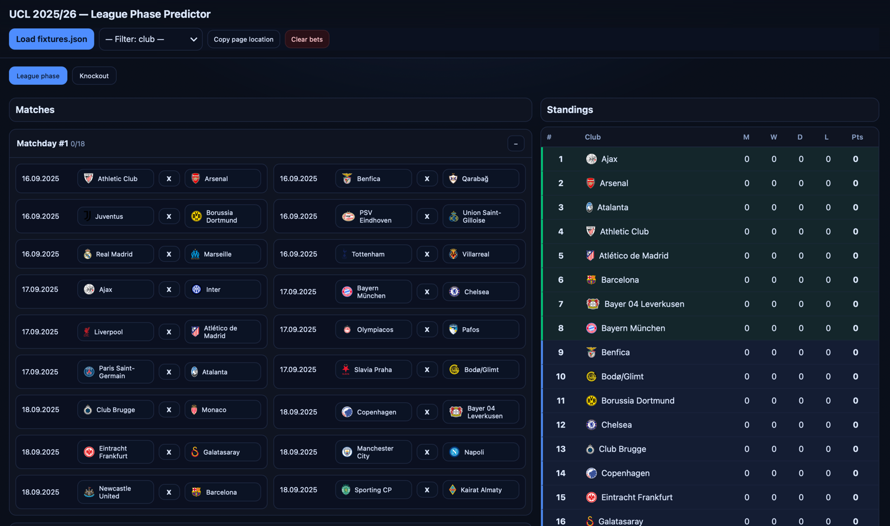

# UCL Predictor

A simple **UEFA Champions League Predictor** web app that allows you to:
- Predict results of league phase matches (1/X/2 format).
- Track standings dynamically.
- Simulate knockout stage brackets by choosing winners.

## 🚀 Features
- Interactive match predictions.
- Automatic calculation of league phase standings.
- Knockout stage bracket predictor.
- Simple UI with basic styling.

## 🛠️ Tech Stack
- **HTML** for structure.
- **CSS** for styling.
- **JavaScript (vanilla)** for app logic.
- **JSON** data files for fixtures and teams.

## 📂 Project Structure
```
UCL-Predictor/
├── data/               # JSON data with fixtures and teams
├── img/                # Images (e.g. team logos)
├── node_modules/       # Node dependencies (ignored in git)
├── app.js              # Main application logic
├── build-fixtures.js   # Script to build fixtures
├── index.html          # Main entry point
├── styles.css          # Styling for the app
├── package.json        # NPM configuration
└── .gitignore          # Ignored files & folders
```

## 🔧 Installation & Running Locally

1. Clone the repository:
   ```bash
   git clone https://github.com/jcob28/UCL-Predictor.git
   cd UCL-Predictor
   ```

2. Install dependencies:
   ```bash
   npm install
   ```

3. Run locally by opening `index.html` in a browser.

## 🌍 Deployment
You can easily deploy this project using **GitHub Pages**:

1. Push your project to GitHub.
2. In repository settings, enable GitHub Pages.
3. Select the branch (`main`) and root directory.
4. Your app will be available under `https://<username>.github.io/UCL-Predictor/`.

## 📸 Preview


## 📜 License
MIT License. Feel free to use and modify!
